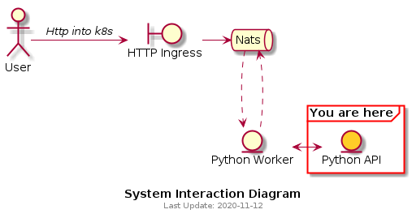

# Python (Sleepy) API

## Summary
Flask app which simulates a call to another system and sleeps 0.01-0.99 seconds before returning a response



## Subjects

## Endpoints
| Endpoint | REST | Description |
|---|---|---|
| /new | GET | *On request, sleeps for random 0.01-0.99 seconds and then returns a response detailing how long it took*

## k8s deployment

```bash
kubectl apply -f sleepy-api-k8s.yaml
```
